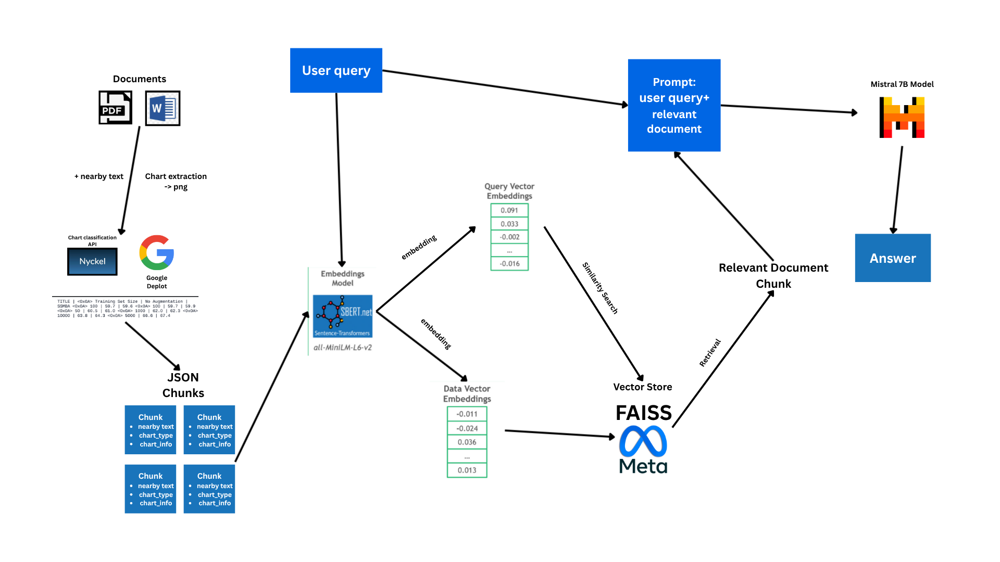

# ChartSenseAI

### Intelligent Chart Analysis and Reconstruction Agent using Local LLMs

**An open-source application for extracting, analyzing, and reconstructing charts from documents using quantized open-source LLMs running on CPU inference.**

---

## Context

- RAG system for chart QA in docx/pdf documents.
- Complete solution of a Chart QA system that actually delivers accurate responses
- can be easily extended to cover more statistical calculations or different chart types

<br><br>


---

## Features

- **Multi-format Document Support**: Extract charts from PDF and DOCX files
- **Multi-chart Type Support**: Handle Bar, Pie, Scatter, and Line charts, can be extended to handle more
- **Semantic Search**: Retrieve relevant charts using natural language queries via RAG
- **Agentic Q&A**: Answer questions about chart data using ReAct reasoning pattern
- **Chart Reconstruction**: Regenerate charts from extracted data with LLM-powered fallback
- **Role-Based Access**: Support for user, tester, and admin roles
- **Performance Metrics**: Track retrieval and inference times for optimization
- **Potential**: Can be easily extended to handle more chart types or statistical calculations.

---

## Quickstart

### Prerequisites

- Python 3.9+
- Ollama installed with Mistral model: `ollama pull mistral`
- ~8GB RAM for smooth operation

### Installation

```bash
python -m venv venv
venv\Scripts\activate
pip install -r requirements.txt
```

### Running the Application

```bash
streamlit run test.py
```

### Usage

1. **Login/Sign Up** - Create an account or log in
2. **Upload Document** - Upload a PDF, DOCX, or PPTX file
3. **Ask Questions** - Type natural language questions about charts
4. **View Results** - Get answers with source chart images
5. **Redraw Charts** - Regenerate charts using the reconstruction engine (Admin/Tester only)

---

## Architecture

### Core Components

Document Upload
    ↓
Chart Extraction (chart_extractor2.py)
    ↓
Vector Database Build (db_build.py)
    ↓
Semantic Search (test.py → FAISS)
    ↓
Agentic Reasoning (practice2.py → Ollama)
    ↓
Answer + Chart Display

### Key Modules

- **`chart_extractor2.py`** - Extract charts and metadata from documents using vision models
- **`db_build.py`** - Build FAISS vector store from extracted chart data
- **`chart_reconstructor.py`** - Reconstruct and visualize charts with LLM fallback
- **`practice2.py`** - ReAct agent for chart question answering with statistical tools
- **`test.py`** - Streamlit web interface and RAG orchestration
- **`authentication.py`** - User authentication and role management

---

## Tools & Technologies

### LLM & AI

- **Ollama**: Local LLM inference engine
- **Mistral-7B**: Quantized open-source LLM model
- **LangChain**: Framework for LLM applications and agents
- **FAISS**: Semantic similarity search and vector database
- **Sentence-Transformers (all-MiniLM-L6-v2)**: Text embeddings for semantic search
- **Pix2Struct**: Vision-to-text model for generating structured string from a chart image
___
## Workflow

### 1. Document Processing
- User uploads PDF/DOCX
- System extracts images and metadata
- Charts are identified and segmented
- Chart data is structured and stored

### 2. Vector Database Creation
- Chart metadata is embedded using Sentence-Transformers
- FAISS index is built for semantic search
- Vector store is persisted locally

### 3. Question Answering (RAG)
- User asks a question in natural language
- Semantic search finds the most relevant chart
- ReAct agent determines needed calculations
- Statistical tools extract values from chart data
- LLM formulates final answer

### 4. Chart Reconstruction
- Original chart data is retrieved
- Matplotlib draws the chart
- If drawing fails, LLM generates custom Python code
- Reconstructed chart is displayed to user

___

## User Roles

| Role | Permissions |
|------|------------|
| **User** | Upload documents, ask questions, view charts |
| **Tester** | All user permissions + performance metrics + chart redrawing |
| **Admin** | All permissions + role assignment |
- Modify user roles by editing the users.yml file.

___

### Typical Performance (CPU Inference)
- Document processing: 2-5 minutes (depends on file size)
- Chart question answering: 3-30 seconds
- Chart reconstruction: 2-5 seconds

___

## Troubleshooting

### Issue: Ollama connection refused
- Ensure Ollama is running: `ollama serve`
- Check model is installed: `ollama list`


### Issue: Chart not found
- Ensure document contains readable charts
- Check extracted_images folder for extraction results
- Try rephrasing the query

### Issue: Chart Type not detected
- Ensure you enter valid Nyckel API credentials in .env file
- Get free credentials by creating an account on https://www.nyckel.com/

___

## References

- [Ollama Documentation](https://ollama.ai)
- [LangChain Documentation](https://python.langchain.com)
- [FAISS Documentation](https://faiss.ai)
- [Sentence-Transformers](https://www.sbert.net)
- [Pix2Struct Deplot Model](https://huggingface.co/google/deplot)
- [Streamlit Documentation](https://docs.streamlit.io)

___
